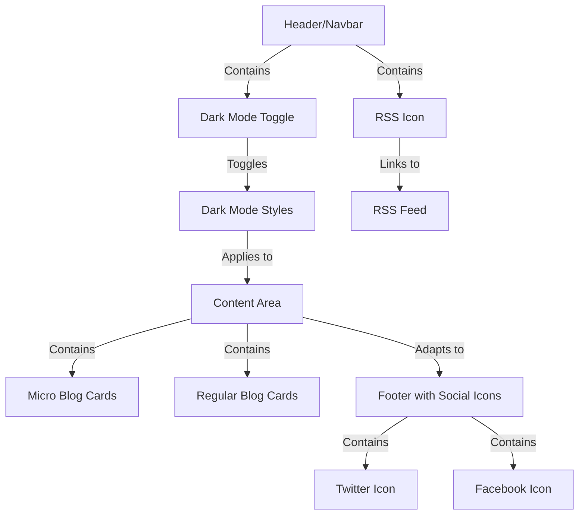

# GhostCMS Custom Theme Project

## Overview

Welcome to the GhostCMS Custom Theme Project! This project aims to create a responsive, dark mode compatible, and highly customizable theme for GhostCMS with a micro-blogging feature. The theme boasts modern, sleek aesthetics with social media integrations, dynamic navigation, and more.

## Table of Contents

-   [Features](#features)
-   [Project Structure](#project-structure)
-   [Architecture Diagram](#architecture-diagram)
-   [Dark Mode Implementation](#dark-mode-implementation)
-   [Installation](#installation)
-   [Customization Guide](#customization-guide)
-   [Contributing](#contributing)
-   [License](#license)

## Features

-   **Micro-Blogging**: Posts tagged with #micro are displayed in a concise, tweet-like format.
-   **Dark Mode**: Users can toggle between light and dark themes, with preferences saved.
-   **Responsive Design**: Seamlessly adapts to different screen sizes.
-   **Social Media Integration**: Facebook, Twitter, and RSS links in both header and footer.
-   **Customization**: Easily adaptable for various color schemes, layouts, and components.

## Project Structure

```
.
├── assets
│   ├── built
│   │   ├── index.css
│   │   └── index.js
│   ├── css
│   │   └── theme
│   │       ├── dark-mode-toggle.css
│   │       ├── footer.css
│   │       ├── global.css
│   │       ├── icons.css
│   │       └── readmore.css
│   └── js
│       ├── dark-mode-toggle.js
│       └── index.js
├── partials
│   ├── icons
│   │   ├── facebook.hbs
│   │   ├── twitter.hbs
│   │   └── rss.hbs
│   ├── micro-card.hbs
│   └── card.hbs
├── layouts
│   ├── default.hbs
│   ├── index.hbs
│   └── post.hbs
└── README.md
```

## Architecture Diagram

The following diagram illustrates the theme's architecture and interactions:



## Dark Mode Implementation

The dark mode feature uses a combination of JavaScript and CSS, toggling the `dark-mode` class on the HTML element to change the appearance of various page elements.

Key Files:

-   JavaScript: `assets/js/dark-mode-toggle.js`
-   CSS: `assets/css/theme/dark-mode-toggle.css`

## Installation

1. Clone the repository:
    ```bash
    git clone https://github.com/aytekinkaplan/micro-blog-pro.git
    ```
2. Navigate to your Ghost CMS theme directory:
    ```bash
    cd path/to/ghost/content/themes
    ```
3. Copy the theme folder:
    ```bash
    cp -R path/to/cloned/repo/ghostcms-custom-theme ./
    ```
4. Restart your Ghost instance:
    ```bash
    ghost restart
    ```
5. Activate the theme from the Ghost admin panel (Settings > Design > Themes).

## Customization Guide

### Changing Colors

1. Open `assets/css/theme/global.css`
2. Modify the color variables in the `:root` selector:
    ```css
    :root {
        --primary-color: #your-color-here;
        --secondary-color: #your-color-here;
        /* Add more custom colors as needed */
    }
    ```

### Updating Fonts

1. Add your custom fonts to `assets/fonts/`
2. Open `assets/css/theme/global.css`
3. Update the font-face declarations:
    ```css
    @font-face {
        font-family: "YourCustomFont";
        src: url("../fonts/your-custom-font.woff2") format("woff2");
        font-weight: normal;
        font-style: normal;
    }
    ```
4. Apply the new font in your CSS:
    ```css
    body {
        font-family: "YourCustomFont", sans-serif;
    }
    ```

### Modifying Social Icons

1. Navigate to `partials/icons/`
2. Replace the SVG content in `facebook.hbs`, `twitter.hbs`, or `rss.hbs` with your preferred icons

## Contributing

We welcome contributions to improve the GhostCMS Custom Theme Project! Here's how you can contribute:

1. Fork the repository
2. Create a new branch (`git checkout -b feature/AmazingFeature`)
3. Make your changes
4. Commit your changes (`git commit -m 'Add some AmazingFeature'`)
5. Push to the branch (`git push origin feature/AmazingFeature`)
6. Open a Pull Request

Please ensure your code adheres to the existing style and that all tests pass before submitting a pull request.

## License

This project is licensed under the MIT License - see the [LICENSE](LICENSE) file for details.

---

For more information or support, please open an issue in the GitHub repository or contact the maintainers directly.

Happy theming!
